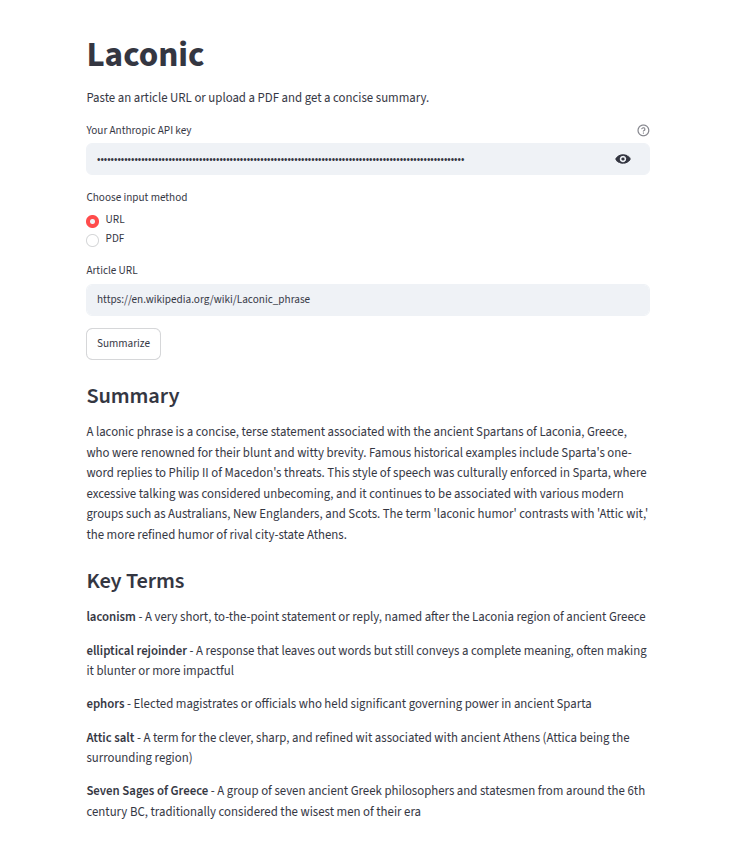

# Laconic

Paste an article URL or upload a PDF and get a concise, plain language summary. plus explanations of any technical jargon, automatically in the same language as the original text.

🔗 **Live app:** https://laconic.streamlit.app/



## Why I built this

I built Laconic as my first project while learning Python and AI engineering, with a practical goal: a tool I'd actually use myself to quickly digest long articles and PDFs for university coursework.

## Features

- **Two input methods**: paste a URL or upload a PDF
- **Plain-language summaries**: concise, 3–4 sentence summaries
- **Jargon explainer**: automatically identifies and explains technical terms a general reader might not know
- **Multilingual**: detects and responds in the original text's language
- **Bring your own API key**: no cost to run, your Anthropic API key is used only for your session and never stored

## How it works

1. The app fetches the article (via `requests` + `BeautifulSoup`) or extracts text from an uploaded PDF (via `pdfplumber`)
2. The extracted text is sent to Claude (Anthropic's API) with a structured prompt requesting a JSON response containing the summary and jargon list
3. The result is parsed and displayed in a clean Streamlit interface

## Tech stack

- **Python**
- **Streamlit** (UI framework)
- **Anthropic API** (summarization)
- **BeautifulSoup** (web scraping)
- **pdfplumber** (PDF text extraction)

## Running locally

```bash
git clone https://github.com/MrZoom24/laconic.git
cd laconic
python3 -m venv venv
source venv/bin/activate
pip install -r requirements.txt
streamlit run app.py
```

You'll need your own [Anthropic API key](https://console.anthropic.com) to use the app. paste it directly into the app's input field, it's never stored or logged.

## What I learned

This was my first real Python/AI project, built from no prior Python experience. Along the way I worked through real debugging (a stale environment variable silently overriding `.env` config, LLM output truncation, JSON parsing edge cases), learned prompt engineering for structured outputs, and practiced proper API key security after accidentally exposing one mid-project (and rotating it immediately).